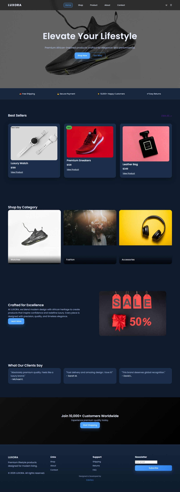
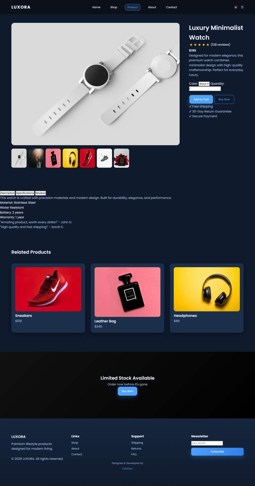

# LUXORA — Premium E-Commerce UI/UX Design

A modern, high-end static e-commerce website designed to demonstrate advanced front-end development, UI/UX design principles, and conversion-focused product presentation.

This project simulates a real-world luxury lifestyle brand with a strong emphasis on aesthetics, user experience, and business-oriented design.

---

##  Live Preview

 The web site is live at : https://edouardkne.github.io/luxora-ecommerce-ui-By-EdoDev/

---

##  Project Overview

LUXORA is a multi-page static e-commerce website built to showcase a premium digital shopping experience.

It is not just a UI project — it is designed as a **conversion-focused product showcase** with realistic user flows and branding.

The goal is to simulate a high-end lifestyle brand experience similar to modern luxury e-commerce platforms.

---

##  Key Features

###  Home Page
- Hero section with strong branding message
- Featured products showcase
- Category browsing experience
- Testimonials and social proof
- Call-to-action sections for conversion

###  Shop Page
- Product grid layout
- Category filtering UI (static simulation)
- Price sorting interface
- Modern card-based design system

###  Product Page
- Image gallery with interactive switching
- Product details and pricing
- Tabs system (Description / Specs / Reviews)
- Trust elements (shipping, returns, security)

###  About Page
- Brand storytelling and identity
- Mission and values section
- Step-by-step production process
- Team presentation layout

###  Contact Page
- Functional contact form UI
- Client information section
- Embedded location map
- Social media integration

---

##  UI/UX Design Highlights

- Dark luxury theme with gold accent branding
- Responsive grid system (mobile-first approach)
- Smooth hover interactions and micro-animations
- Consistent design system across all pages
- Conversion-oriented layout structure
- Real-world e-commerce UX patterns

---

##  Tech Stack

- HTML5 (Semantic structure)
- CSS3 (Custom design system, Flexbox, Grid)
- Vanilla JavaScript (Interactions & UI behavior)
- Unsplash API images (high-quality placeholders)

No frameworks or libraries were used in order to demonstrate strong foundational front-end skills.

---

##  JavaScript Features

- Scroll-based animations (Intersection Observer API)
- Product image gallery switching
- Tab navigation system (Product page)
- Contact form validation
- Button ripple interaction effect
- Smooth scroll behavior
- Navbar dynamic scroll effect

---

##  Responsive Design

The project is fully responsive and optimized for:
- Desktop (primary experience)
- Tablet
- Mobile devices

Layout adapts dynamically using CSS Grid and Flexbox.

---

##  Project Purpose

This project was built for:

- Front-end development portfolio showcase
- UI/UX design demonstration
- E-commerce interface simulation
- Freelance profile enhancement (Upwork / GitHub)
- Client attraction through visual storytelling

---

##  What This Project Demonstrates

This project shows ability to:

- Build complete multi-page web applications
- Design professional UI systems from scratch
- Apply UX principles for conversion optimization
- Create consistent branding across pages
- Structure scalable front-end architecture
- Build production-ready static websites

---

##  Screenshots

###  Home Page


Modern luxury homepage with hero section, featured products, and elegant UI design.

---

###  Product Page


Interactive product page with image gallery, tabs system, and detailed product layout.
---

##  Folder Structure

```plaintext
/luxora-store
│
├── index.html
├── shop.html
├── product.html
├── about.html
├── contact.html
│
├── styles.css
├── script.js
│
└── Images.previews/
        ├── HomePage.jpeg
        └── ProductPage.jpeg
```

---

##  Deployment

This project can be deployed using:

- GitHub Pages
- Netlify
- Vercel

Simply upload repository and enable static hosting.

---

##  Author

Developed by **EdoDev**

Front-end Developer | UI/UX Enthusiast

- GitHub: https://github.com/edouardkne
- Upwork: https://www.upwork.com/freelancers/~0104ed4c9a50a8fe2b?mp_source=share
- Gmail : edouard.kne.3@gmail.com

---

##  Notes

This is a portfolio project and not a real commercial store.
All products and branding are fictional and used for demonstration purposes only.

---

##  Future Improvements

- Add cart system (local storage)
- Add animations with GSAP
- Integrate backend (Node.js or Firebase)
- Add real checkout system
- Add product search functionality

---

##  Final Thought

This project was designed to demonstrate **real-world front-end capability**, combining UI design, UX structure, and business-oriented thinking into a single cohesive experience.

